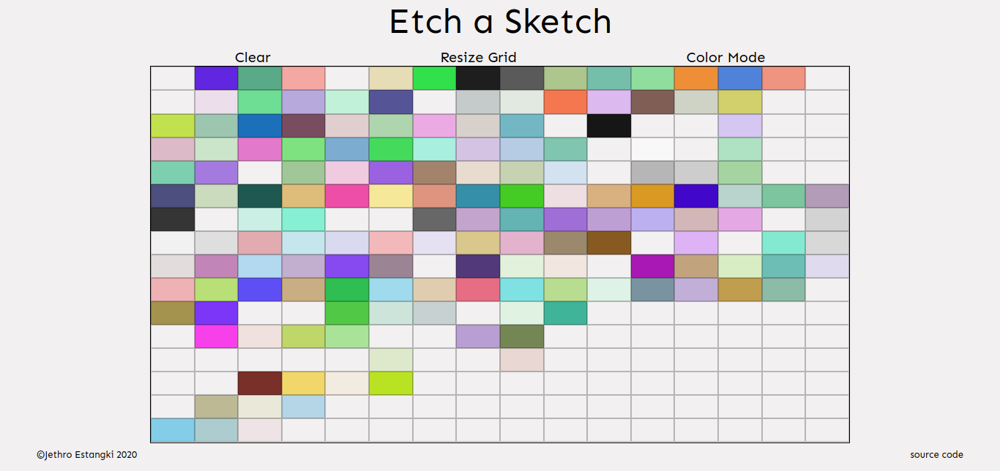

# Etch a Sketch
A browser version of something between a sketchpad and an Etch-A-Sketch. 
From [The Odin Project's](https://www.theodinproject.com/) [curriculum](https://www.theodinproject.com/courses/web-development-101/lessons/etch-a-sketch-project)

  
## To-do
* Do the 2nd sentence of the optional part in [The Odin Project's curriculum](https://www.theodinproject.com/courses/web-development-101/lessons/etch-a-sketch-project)
  * (Optional): Instead of just changing the color of your grid from black to white (for example) have each pass through it with the mouse change to a completely random RGB value. <strong>Then try having each pass just add another 10% of black to it so that only after 10 passes is the square completely black.</strong>
  
## References
* [For each loop](https://developer.mozilla.org/en-US/docs/Web/JavaScript/Reference/Statements/for_each...in)
* [Event Listeners](https://developer.mozilla.org/en-US/docs/Web/API/EventTarget/addEventListener)
* [Random RGB Colors](https://stackoverflow.com/a/23095818)
* [CSS Grid](https://learncssgrid.com/)
